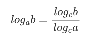
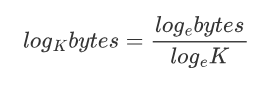

# js-bytes-format

将字节（Bytes）转成 KB、MB、GB、TB 等，是十分常见的需求，一般做法是，通过判断 `bytes / 1024` 是否大于 1024，来决定是否提升单位：

## if else 实现

```ts
function formatBytes(bytes: number) {
  const K = 1024;

  if (bytes < K) {
    return `${bytes} B`;
  } else if ((bytes /= K) < K) {
    return `${bytes.toFixed(2)} KB`;
  } else if ((bytes /= K) < K) {
    return `${bytes.toFixed(2)} MB`;
  } else if ((bytes /= K) < K) {
    return `${bytes.toFixed(2)} MB`;
  } else if ((bytes /= K) < K) {
    return `${bytes.toFixed(2)} GB`;
  } else if ((bytes /= K) < K) {
    return `${bytes.toFixed(2)} TB`;
  } else if ((bytes /= K) < K) {
    return `${bytes.toFixed(2)} PB`;
  } else if ((bytes /= K) < K) {
    return `${bytes.toFixed(2)} EB`;
  } else if ((bytes /= K) < K) {
    return `${bytes.toFixed(2)} ZB`;
  } else {
    return `${bytes.toFixed(2)} YB`;
  }
}

formatBytes(1024 * 1024); // "1.00 MB"
```

`(bytes /= K) < K` 是一个简写，等同于：

```ts
bytes = bytes / K;
if (bytes < K) {
  // ...
}
```

## while 实现

通过 if-else 实现略显繁琐，可以用 `while` 循环改写：

```ts
function formatBytes(bytes: number) {
  if (bytes === 0) {
    return "0 B";
  }

  const sizes = ["B", "KB", "MB", "GB", "TB", "PB", "EB", "ZB", "YB"];
  const K = 1024;
  let i = 0;

  while (bytes >= 1024 && i < sizes.length - 1) {
    bytes /= K;
    i++;
  }

  return `${bytes.toFixed(2)} ${sizes[i]}`;
}

formatBytes(1024 * 1024); // "1.00 MB"
```

## Math.log 实现

相比 if-else，使用 while 会“清爽”许多，但还有更好的方法：`Math.log`：

```ts
function formatBytes(bytes: number) {
  if (bytes === 0) {
    return "0 B";
  }
  const sizes = ["B", "KB", "MB", "GB", "TB", "PB", "EB", "ZB", "YB"];
  const K = 1024;

  const i = Math.floor(Math.log(bytes) / Math.log(K));
  bytes /= Math.pow(K, i);

  return `${bytes.toFixed(2)} ${sizes[i]}`;
}

formatBytes(1024 * 1024); // "1.00 MB"
```

相比 `while`，它们都是在常数时间内完成，所以性能差异可能并不明显，但后者通过对数计算直接得到 i，显得更加“高级”。

对数运算是指数运算的“逆运算”，我们想要得到的 i，本质上，是获取以 `K` 为底，`bytes` 的对数：$$log_{K}{bytes}$$，然后再向下取整，得到在 `sizes` 中对应的下标。

由于 JavaScript 没有提供计算任意底数的指数方法，所以用到了指数“换底公式”：



`Math.log` 是 JavaScript 中求自然对数的内置方法，`Math.log(bytes) / Math.log(K)` 等同于：



### 限制有效范围

到目前为止，我们的 `formatBytes` 函数还没有对参数进行限制，虽然有 TypeScript 的约束，但它只在开发阶段有效，并且无法判断参数是否为非负整数，所以补充以下代码：

```ts
function formatBytes(bytes: number) {
  // 当 bytes 不是非负整数，或者 bytes 大于 2 ** 53 - 1 时，抛出一个异常
  if (
    !(Number.isInteger(bytes) && bytes >= 0 && bytes <= Number.MAX_SAFE_INTEGER)
  ) {
    throw new Error(
      "Invalid input: `bytes` must be a non-negative integer within Number.MAX_SAFE_INTEGER",
    );
  }

  // ...
}

formatBytes(Number.MAX_SAFE_INTEGER); // "8.00 PB"
formatBytes(Number.MAX_SAFE_INTEGER + 1); //  Error
```

`Number.MAX_SAFE_INTEGER` 是一个常量，等同于 2 的 53 次方减 1，这是 JavaScript 能够精确计算的最大整数，对应还有 `Number.MIN_SAFE_INTEGER`，表示 JavaScript 能够精确计算的最小整数：

```ts
Number.MAX_SAFE_INTEGER === Math.pow(2, 53) - 1; // true
Number.MIN_SAFE_INTEGER === -(2 ** 53 - 1); // true
```

## BigInt 实现

如果你足够细心，会发现我们的 formatBytes 能够处理的最大数量是 `8.00 PB`，也就是 `Number.MAX_SAFE_INTEGER` 个字节，再大就会丢失精度：

```ts
2 ** 53 - 1; // 正常 9007199254740991
2 ** 53; // 正常 9007199254740992
2 ** 53 + 1; // 异常：9007199254740992
2 ** 53 + 2; // 异常：9007199254740994
```

这个问题并不常见，因为 8.00 PB 已经非常大了，足够日常使用，如果还要支持更大的数量级，在不借助第三方库（比如 [big-integer](https://www.npmjs.com/package/big-integer)）的前提下，可以用 ES2020 引入的基础数据类型：[BigInt](https://github.com/tc39/proposal-bigint)，下面是改写后的代码：

```ts
function formatBytes(bytes: string | bigint | number) {
  try {
    bytes = BigInt(bytes);
    if (bytes < 0n) {
      throw new Error();
    }
  } catch {
    throw new Error(
      "Invalid input: `bytes` must be an integer, BigInt, or an integer string, and they all must be non-negative",
    );
  }

  if (bytes === 0n) {
    return "0 B";
  }

  const sizes = ["B", "KB", "MB", "GB", "TB", "PB", "EB", "ZB", "YB"]; // and more ...
  const K = 1024n;
  let i = 0n;
  const originBytes = bytes;
  while (bytes >= K && i < sizes.length - 1) {
    bytes /= K;
    i++;
  }

  const intPart = bytes;
  const level = K ** i;
  const decimalPart = originBytes - level * intPart;
  const num = Number(intPart) + Number((decimalPart * 1000n) / level) / 1000;

  if (num > Number.MAX_SAFE_INTEGER) {
    throw new Error(
      `Invalid input: \`bytes\` exceeds the maximum precise value that ${
        sizes[sizes.length - 1]
      } can represent`,
    );
  }

  return `${num.toFixed(2)} ${sizes[Number(i)]}`;
}

// formatBytes(1024n ** 8n * BigInt(Number.MAX_SAFE_INTEGER)); // 9007199254740991.00 YB
// formatBytes(1024n ** 8n * BigInt(Number.MAX_SAFE_INTEGER + 1)); // Error
```

- Math.log() 不支持传入 BigInt，所以选择用 while 实现；
- 由于 bigint 做除法会自动省略（不是四舍五入）小数部分，所以代码中单独对小数部分进行处理；
- 当 bytes 大到连 YB 量级都大于 Number.MAX_SAFE_INTEGER 时，会触发一个报错，如果不想报错，可以往 sizes 中追加比 YB 更高的数量级；
